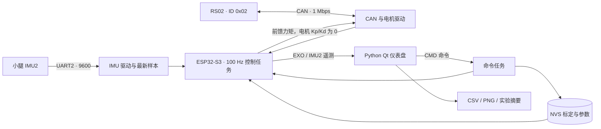

# KneeExo · 膝关节外骨骼

基于 **ESP32-S3 + RobStride RS02 + WitMotion IMU** 的单侧膝关节外骨骼实验项目。仓库包括嵌入式固件、Python 上位机、标定和数据分析工具。

目前已实现 CAN 电机通信、小腿姿态读取、100 Hz 实验控制、六状态步态状态机、重力补偿模型和实验数据导出。**当前阶段是低力矩台架原型，尚未完成可靠的人体步行助力验证。**

> 当前 `normal` 会在零位采样后自动使能电机。`TRANSPARENT` 仍可能输出状态阻抗和重力补偿，`SAFE` 也不等于电机停止。恢复项目时先离体检查，具体代码缺口见[项目现状与改进清单](docs/project-status.md)。

## 从哪里开始

| 你要做的事 | 文档 |
|---|---|
| 很久没做，先了解进度 | [项目现状、历史证据、改进优先级](docs/project-status.md) |
| 穿上没有助力，怀疑烧错版本 | [无助力排查](docs/troubleshooting.md) |
| 配环境、选择模式、重新烧录 | [构建与烧录](docs/flashing.md) |
| 理解任务、驱动、数据流和控制公式 | [软件架构](docs/architecture.md) |
| 核对引脚、电机 ID、串口和电源 | [当前硬件与软件配置](docs/specs.md) |
| 启动仪表盘、记录和分析数据 | [PC 工具说明](tools/README.md) |
| 查串口字段、命令、参数保存规则 | [串口协议](docs/protocol.md) |
| 验证改动 | [测试与台架验证](tests/README.md) |

## “没有助力”先看这几项

1. **固件版本与模式是两件事。** 排查开始时本机 `sdkconfig` 和旧构建均为 `NORMAL + TRANSPARENT`；旧构建版本 `0ff87a3-dirty`，最新已有源码提交 `d6b3a68`。这些只是本地记录，板上版本须从串口确认。本次新增启动 `$INFO` 和只读 `$CMD,GET_INFO` 查询。
2. **`normal` / `wear` 不启用速度跟随助力。** `assist` 才增加 `+B × 膝角速度` 项，默认仅 0.10 Nm/(rad/s)、上限 0.35 Nm，低于 0.12 rad/s 不产生该项。它不提供静止承重支撑。
3. **最新代码的状态机仍在 transparent 下工作。** 静止常处于 `SAFE`，状态项只给很小阻尼；各主动状态的阻抗分量限幅为 0.25–0.65 Nm，不能按电机峰值力矩理解助力能力。
4. **小腿 IMU 要接 IMU2：MCU TX=GPIO21、RX=GPIO38，9600 波特率。** 只沿用旧文档接 IMU1，不能为当前控制提供所需小腿姿态。
5. **重力补偿默认 G/phi/bias 都是 0。** 设备保存过的 NVS 参数可能覆盖默认值；普通重烧不会清除这些参数。先读 `GET_PARAMS`，再决定需要重新标定哪里。

完整判定顺序：版本/模式 → IMU2 与 CAN 反馈 → 当前参数 → `state` → `tau_g / tau_imp / tau_cmd / tau_fb`。不要单纯加大增益来寻找体感，见[排查流程](docs/troubleshooting.md)。

## 架构概览



控制端先将电机坐标转换成“膝屈曲为正”的关节坐标，再在 ESP32 上计算重力补偿和状态阻抗，最后作为力矩前馈发给电机。**当前不是把上层 Kp/Kd 直接下发给电机实现整套阻抗。** 任务分工、状态参数和限制见[架构文档](docs/architecture.md)。

## 快速开始（Windows）

目标：`ESP32-S3-N16R8`，工程基线：`ESP-IDF v5.5.4`。从项目根目录执行：

```powershell
. .\tools\idf-shell.ps1
idf.py --version

# 不传串口只编译，不接触硬件
.\tools\flash.ps1 normal
```

确认接线和台架条件后，按实际 COM 口分别验证：

```powershell
python -m serial.tools.list_ports -v
.\tools\flash.ps1 twai COM3       # CAN 控制器自环；不能证明外部 CAN 接线正确
.\tools\flash.ps1 imu COM3        # IMU 遥测，观察 IMU2
.\tools\flash.ps1 motor COM3      # 反馈测试；脚本关闭自动摆动和限位搜索
```

每次烧录会替换之前的应用模式。`COM3` 是示例，不是固定端口。`normal`、`wear`、`assist` 的烧录和上位机操作须接着读[烧录步骤](docs/flashing.md)，特别是自动使能、主控制台和 NVS 部分。

### PC 仪表盘

建议独立虚拟环境；以下命令只安装 PC 工具，不改变固件工具链：

```powershell
python -m venv .venv
.\.venv\Scripts\python.exe -m pip install -r tools\requirements.txt
.\.venv\Scripts\python.exe tools\exo_dashboard_qt.py --port COM3 --csv logs\recovery.csv
```

同一串口只能被一个程序占用，先退出 `idf.py monitor`（`Ctrl+]`）。新固件可用 **Firmware info** / **Read params** 读取版本和运行参数；旧固件可能对 `GET_INFO` 返回 UNKNOWN。只看到遥测、按钮没反应时，检查是否接在只有输出的次控制台。[工具说明](tools/README.md)包含采集和分析命令。

## 目录

```text
main/                         启动分发、各 profile、控制与命令任务
components/config/            Kconfig 选项、接线及机械标定常量
components/drivers/           CAN、RS02、WitMotion 驱动
tools/                        烧录、Qt/Matplotlib 上位机、离线分析
tests/                        主机回归测试与历史硬件测试片段
docs/                         架构、排查、协议、规格、变更记录
docs/skills/*/datasheets/      项目保存的硬件参考资料
```

`sdkconfig`、`build/`、实验 CSV/PNG 是本地产物，默认不提交。`sdkconfig.defaults` 只是初始默认项，不能代表板上模式；完整可复现实验还需要构建配置和运行参数记录。

## 接下来优先做什么

- **先补输出安全路径**：明确停止/透明/助力语义，传感器超时与故障锁存，所有模式统一限制最终输出，验证限位后的实际命令。
- **再补标定与观测**：修复旧 NVS 覆盖当次零位的问题，统一重力力矩符号，记录 IMU 数据年龄、故障位和电机运行状态。
- **最后优化助力效果**：采集有标注的状态数据、辨识机构重力/摩擦，在输出范围受控的台架上调整各状态参数，之后再评估穿戴效果。

详细问题、代码入口和验收条件见[改进清单](docs/project-status.md)。[PRD](docs/system_prd.md)是需求与目标，不能作为已完成或已测性能的证明；[CHANGELOG](docs/CHANGELOG.md)保留历史演进。
