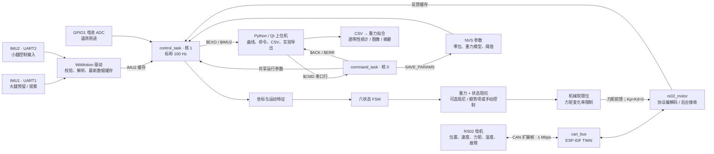

# 系统架构与控制流程

本文按当前源码说明已实现行为。产品目标见 [PRD](system_prd.md)，差距与改进顺序见 [项目现状](project-status.md)。文中的“100 Hz”“力矩限幅”是程序配置与计算逻辑，不代表已经完成实时性或穿戴效果验收。

## 1. 系统边界

当前工程是 **ESP32-S3 + 单个 RS02 电机 + 小腿 IMU 的单侧膝关节实验平台**，包含 ESP-IDF 固件和 Python 上位机。

- 固件负责采集、关节坐标换算、规则式步态状态机、力矩计算和 CAN 下发。
- 上位机负责显示、发调试命令、参数拟合和保存实验记录；控制循环在 ESP32 上运行。
- IMU 驱动支持多个 UART，两个通道均会初始化；当前 `normal` 控制只使用 **IMU2/UART2 小腿通道**。
- RS02 驱动预留最多 4 个电机句柄，应用层只有一个 `g_motor`；双腿协同控制尚未实现。
- RS02 内部电流环、传感器融合固件、机械装配与电源硬件不在本仓库实现范围内。



## 2. 目录与职责

| 入口 | 实际职责 |
|---|---|
| [CMakeLists.txt](../CMakeLists.txt)、[sdkconfig.defaults](../sdkconfig.defaults) | ESP-IDF 工程、目标芯片、Flash/PSRAM 和默认系统配置 |
| [Kconfig.projbuild](../components/config/Kconfig.projbuild) | 编译时选择 profile、控制频率、穿戴子模式和实验参数 |
| [config.h](../components/config/include/config.h) | 引脚、CAN ID、坐标方向、机械限位、重力模型默认值 |
| [app_main.cpp](../main/app_main.cpp) | 启动日志，按编译配置分发到一个 profile |
| [profiles/](../main/profiles/) | `normal`、`imu_only`、`motor_test`、`twai_loopback` 四类入口 |
| [control_task.cpp](../main/control_task.cpp) | 采集、特征、FSM、力矩计算、遥测、串口命令、NVS 与 ADC；目前集中在一个文件 |
| [can_bus.c](../components/drivers/can_bus/can_bus.c) | TWAI 初始化与收发薄封装，含总线状态打印接口 |
| [rs02_motor.cpp](../components/drivers/rs02_motor/rs02_motor.cpp) | RS02 私有协议，使能/停止、模式、运控、参数读写、反馈解析 |
| [witmotion_imu.c](../components/drivers/witmotion_imu/witmotion_imu.c) | `0x55` 开头的 11 字节帧，校验和与失同步恢复；解析加速度、角速度、欧拉角、四元数 |
| [exo_dashboard_qt.py](../tools/exo_dashboard_qt.py) | PyQt6 + pyqtgraph 上位机，推荐的当前数据查看入口 |
| [gravity_id_fit.py](../tools/gravity_id_fit.py)、[transparency_report.py](../tools/transparency_report.py) | 基于 CSV 的离线重力拟合、力矩 RMS/峰值与速度相关性统计 |
| [tests/](../tests/) | 主机协议回归测试与历史硬件验证片段；尚无完整控制测试套件 |

## 3. 编译模式与启动过程

### 四个 profile

| Profile | 会做什么 | 与助力的关系 |
|---|---|---|
| `twai_loopback` | TWAI 自发自收 50 帧，然后空闲 | 无电机控制；通过仅证明控制器自检路径，不能证明外部 CAN 线束或电机正常 |
| `imu_only` | 探测小腿 UART 常见波特率，初始化两路 IMU，输出 `$IMU1/$IMU2` | 无电机控制；当前流速最多 25 Hz |
| `motor_test` | 扫描 CAN、读取电机参数；显式启用子选项才摆动或寻机械限位 | 联调与离体标定，不运行步态控制 |
| `normal` | 运行 IMU、CAN、电机、控制循环和上位机命令通道 | 所有 `wear/damp/assist/gait/assistgait` 脚本别名最终都构建这一 profile |

`normal` 的现有启动顺序见 [profile_normal.cpp](../main/profiles/profile_normal.cpp)：

1. 初始化 NVS、CAN、IMU1/IMU2 和 RS02 句柄。
2. 默认倒数 3 秒，再采集约 3 秒的电机位置平均，设本次用户零位。读取超时会延长实际时长；采样失败当前会继续。
3. 将电机设置为运控模式并发送使能。
4. 在核 0 创建 `command_task`，在核 1 创建 `control_task`。
5. 控制任务加载已保存的 NVS 参数，初始化电池 ADC，开始循环。

**关键细节：** 第 5 步加载的 `motor_zero` 可以覆盖第 2 步刚得到的用户零位；电机使能也没有等待完整的传感器健康与标定成功条件。后续应把启动流程改为显式的校验、待使能和运行状态，详见 [P0 改进](project-status.md#3-p0先补齐再开展有源穿戴测试)。

### 任务与数据一致性

| 任务 | CPU 核 | 职责 |
|---|---|---|
| `imu_rx_1`、`imu_rx_2` | 0 | 读取 UART 并更新互斥锁保护的数据缓存 |
| `rs02_rx` | 0 | 独占 CAN 接收，分发到电机反馈缓存、队列与参数应答信号量 |
| `command_task` | 0 | 读取主控制台命令，更新共享参数，输出 ACK/ERR |
| `control_task` | 1 | 标称 10 ms 一次，读取缓存、计算和发送力矩、输出遥测 |

控制周期由 `vTaskDelayUntil()` 调度，传感器并非同步采样。RS02 非阻塞反馈读取和命令共享参数尚未采用完整的跨核一致性保护。串口打印、ADC 采样和 CAN 最长 20 ms 发送等待也在控制任务内，因此不能由“设为 100 Hz”推导出周期抖动或端到端延迟已经达标。

## 4. 关节坐标与标定

统一约定：**膝关节屈曲为正，伸膝为负**。当前配置对应已有右腿装配，换装、改减速传动或换电机后必须重新核对。

```text
joint_mech = JOINT_DIR_SIGN × (motor_pos - JOINT_ZERO_OFFSET_RAD)
joint_user = joint_mech - user_zero
joint_vel  = JOINT_DIR_SIGN × motor_vel
joint_tau  = JOINT_DIR_SIGN × motor_tau
shank_deg  = IMU_SHANK_PITCH_SIGN × euler[IMU_SHANK_PITCH_AXIS] - imu_zero
```

| 参数 | 当前源码值 | 含义 |
|---|---|---|
| `JOINT_DIR_SIGN` | `-1` | 电机正转映射为伸膝方向 |
| `JOINT_ZERO_OFFSET_RAD` | `+1.74678 rad` | 机械伸膝端对应的电机原始位置 |
| `KNEE_EXT_LIMIT_RAD` | `0 rad` | 机械坐标伸膝边界 |
| `KNEE_FLEX_LIMIT_RAD` | `2.53286 rad` | 机械坐标屈膝边界，约 145.1° |
| `IMU_SHANK_PITCH_AXIS / SIGN` | `1 / +1` | 使用 Pitch/Y 作为小腿角度，前摆为正 |

软件软限位使用 `joint_mech`，FSM 和阻抗目标使用 `joint_user`。因此机械限位、穿戴零位与 IMU 零位是不同概念。`ZERO_MOTOR` 在当前命令协议中只改运行时 `user_zero`，不会调用电机驱动的 `rs02_set_zero()` 去重写电机机械零位。

## 5. 状态机与实际力矩计算

### 特征与状态

`update_features()` 从小腿角度差分估算角速度，并对小腿角速度、膝速度与加速度模长做低通滤波，得到落地尖刺、屈膝峰值、小腿越过竖直位等事件。`update_state_machine()` 用阈值和超时决定状态：

| 状态 | 含义 | 状态阻抗 `K` / `B` | 平衡膝角 | 状态阻抗分量限幅 |
|---|---|---|---|---|
| `SAFE` | 被动观察/回退状态 | `0 / 0.04` | 0° | ±0.25 Nm |
| `IDS` | 初始双支撑 | `2.5 / 0.45` | 8° | ±0.45 Nm |
| `SINGLE` | 单支撑 | `3.5 / 0.35` | 10° | ±0.50 Nm |
| `ISWING` | 初始摆动 | `2.5 / 0.10` | 60° | ±0.65 Nm，含 +0.10 Nm 前馈 |
| `MSWING` | 中期摆动 | `0 / 0.03` | 0° | ±0.25 Nm |
| `TSWING` | 末期摆动 | `2.0 / 0.35→1.00` | 3° | ±0.55 Nm，阻尼在约 0.3 秒内增加 |

`K` 单位为 Nm/rad，`B` 单位为 Nm/(rad/s)。具体阈值、转移和超时以 [update_state_machine / params_for_state](../main/control_task.cpp) 为准。没有足底接触传感器；这些状态名称代表规则推断，不是已经测得的真实支撑相标签。

FSM 的全局回退条件包括用户膝角小于 -5° 或大于 100°、膝速度绝对值大于 8 rad/s、传感器故障和 `SAFE` 请求。电机反馈以 120 ms 为新鲜度上限，IMU 目前只检查是否曾收到带时间戳的数据。这些条件只决定 FSM 回退，不等价于最终输出被切断；它们与约 145° 的机械坐标屈膝限位也不是同一层限制。

当前 `CONFIG_KNEEEXO_GAIT_IMU_ENABLE` 没有包住 FSM 的执行逻辑；关闭该选项也不会关闭状态估计或状态阻抗。状态阻抗的运行时默认值为开启，可通过 `STATE_CTRL` 调试命令改变。

### 从传感器到电机指令

正常自动控制路径的计算为：

```text
tau_gravity = clamp(G × sin(shank_rad + phi) + bias, ±3 Nm)
tau_state   = clamp(K × (theta_eq - joint_user) - B × joint_vel + ff,
                    ±state_limit)
tau_target  = tau_gravity + tau_state + tau_wear
```

- `transparent`：不额外叠加 `tau_wear`；**重力与状态阻抗仍可能输出**。
- `damping`：增加 `-B × joint_vel`，默认 `B=0.30`，该分量限幅 ±0.80 Nm。
- `assist`：速度超过默认 0.12 rad/s 死区后增加顺势项，默认 `B=0.10`，该分量限幅 ±0.35 Nm；接近机械伸膝端且快速屈膝时，另加限幅 0.80 Nm 的反向缓冲阻尼。
- `MANUAL_TORQUE`：用手动限幅力矩替代上述自动分量；`MANUAL_POS`：用手动位置阻抗替代状态阻抗，同时保留重力补偿。

随后按机械位置禁止继续朝边界外推的目标力矩，并以 **2 Nm/s** 限制命令力矩的变化率。最后通过 `joint_to_motor_torque()` 转回电机坐标，调用 `rs02_motion_control()`。

**实际发给电机的 `Kp`、`Kd` 都为 0**：当前阻抗是在 ESP32 上计算为力矩前馈，再发给电机；menuconfig 的 `DEFAULT_KP/KD` 不是这条 `normal` 控制路径的助力增益。

上述分量限幅不等于叠加后的统一输出限幅。当前软限位发生在变化率滤波之前，已有力矩不会因目标被置零就瞬间归零。`SAFE` 也只是一个仍有小阻尼的 FSM 状态，不能当作电机停机或硬件急停。

### 为什么可能感觉不到助力

源码中的重力系数 `G/phi/bias` 默认均为 0；没有已保存标定参数时，这部分实际输出为 0。状态阻抗的默认限幅仅约 0.25～0.65 Nm，顺势助力分量默认最多 0.35 Nm。静止、低速、FSM 停在 `SAFE`、软件限位屏蔽输出、上位机关闭状态控制等情况都可能令命令接近 0。

因此应同时观察 `state`、`tau_g`、`tau_imp`、`tau_cmd`、`tau_fb`、`motor_ok` 和有效配置；不能单凭“没有体感”判断固件版本错误。完整恢复步骤见 [README](../README.md)。

## 6. 上位机、协议与参数持久化

通信为同一控制台上的文本行；普通 ESP 日志和协议数据会交错。

| 前缀 | 方向 | 内容 |
|---|---|---|
| `$INFO` | 固件 → PC | 本次新增的只读固件身份：应用版本、profile、wear 子模式、构建日期/时间和 ESP-IDF 版本；启动打印，normal 可用 `$CMD,GET_INFO` 查询 |
| `$EXO` | 固件 → PC | 时间、状态、运动特征、关节角速度、分项/最终/反馈力矩、阻抗参数、事件、电压、反馈年龄与有效位、冲击量 |
| `$IMU1/$IMU2` | 固件 → PC | 时间、三轴加速度、角速度、欧拉角、温度；`normal` 输出 IMU2 |
| `$CMD` | PC → 固件 | 置零、重力参数、状态控制/锁定、手动控制、阈值、保存/查询参数 |
| `$ACK/$ERR` | 固件 → PC | 请求接收、参数值或解析结果；ACK 不代表动作效果或安全条件已验证 |

默认 100 Hz 控制时，`normal` 输出 `$EXO` 约 50 Hz、`$IMU2` 约 25 Hz、文字日志约 2 Hz。IMU 的实际新数据速率另由传感器配置和 UART 带宽决定；重复发布缓存不增加传感器采样率。

`$EXO` 当前有效负载依次为：

```text
t_us,state,shank_deg,shank_rate_dps,acc_g,knee_rad,knee_vel,
tau_g,tau_imp,tau_cmd,tau_fb,k,b,theta_eq,landing,flex_peak,
shank_cross,bat_v,motor_age_ms,motor_ok,impact_g
```

[Qt 上位机](../tools/exo_dashboard_qt.py) 可记录 CSV、保持按键采集实验片段并导出图片/摘要，还可以拟合重力参数和运动阈值。它默认在串口积压过大时丢弃接收缓存以恢复实时显示，所以实验 CSV 不能未经检查就视为无丢帧原始采样记录。

NVS 命名空间 `exo` 持久化以下参数：IMU 零位、用户电机零位、重力 `G/phi/bias`、重力开关、落地阈值、摆动速度阈值。状态控制开关、状态锁定、手动力矩/位置模式不在这份保存列表内。普通应用重新烧录不会自动重置这些参数。

Qt 上位机的 `Firmware info` 和 `Read params` 分别发送 `GET_INFO` 与 `GET_PARAMS`；后者还报告当前 `force_safe` 与 `manual_mode`。旧固件可能不支持身份查询，不能仅凭无响应判断串口故障。

## 7. 架构演进建议

保持底层驱动接口，逐步将 `control_task.cpp` 拆分为 `sensor_snapshot`、`calibration`、`gait_estimator`、`torque_controller`、`safety_supervisor` 和 `telemetry/commands`。先抽出可以用记录数据回放的纯计算逻辑，再加入测试；将高优先级控制循环中的打印、NVS 写入和慢采样移到独立任务。

其中 `safety_supervisor` 应位于最终电机指令之前，统一处理反馈超时、无效数值、最终力矩限幅、使能状态和故障锁存。其验证优先于增加助力幅值或更复杂的步态模型。
